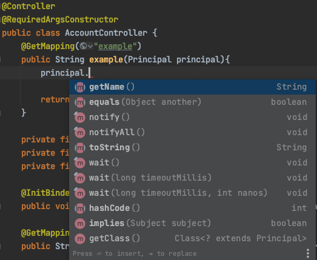

# @AuthenticationPrincipal
---
애플리케이션에서 로그인한 사용자와 관련된 특정한 정보들을 조회하는 건 모든 회원제 어플리케이션에서 빈번하게 일어나는 작업이다.  
하지만 이를 위해 매번 사용자가 서버에 요청을 보낼때마다 DB에 접근해서 데이터를 가져오는 것은 그 자체로 비효율적이다.

따라서 한번 인증된 사용자 정보를 세션에 담아놓고 세션이 유지되는 동안 유저객체를 DB접근 없이 가져다 쓰는 것을 생각 해볼 수있다.  
Spring Security에선 이 정보를 SecurityContextHolder내부의 SecurityContext에 Authentication 객체로 저장해두고 있으며, 이를 참조하는 방법은 크게 3가지가 있다.
***

>* 컨트롤러에서 Principal 객체를 주입받아 사용
* 컨트롤러에서 @AuthenticationPrincipal 선언하여 엔티티 객체 받아오기
* 컨트롤러에서 @AuthenticationPrincipal 선언하여 엔티티의 어댑터 객체 받아오기(가장 권장)

1. 컨트롤러에서 Principal 객체 주입받아 사용

가장 간단하게 사용할 수 있는 방법이지만, 이는 <strong>Spring Security가 제공하는 객체가 아닌</strong>, 자바에 정의되어있는 Principal 객체를 바인딩 해주는 것이라 사용할 수 있는 메소드가 getName()밖에 없다.

2. @AuthenticationPrincipal 선언해서 엔티티 객체 받아오기

엔티티객체

서비스클래스(UserDetailsService 구현)

컨트롤러클래스

이처럼 엔티티에 있는 모든 필드들의 참조가 가능해진다.

3. 컨트롤러에서 @AuthenticationPrincipal 선언하여 엔티티의 어댑터 객체 받아오기(가장 권장)
2번과 코드 중복이 많으므로 글로 간단히 설명하면
>* 엔티티 객체를 필드로 갖고있는 어댑터(DTO)클래스 생성하여 User객체 상속  
>* UserDetailsService의 loadByUsername()에서 위에서 만든 어댑터클래스 반환하도록 수정
(물론 어댑터클래스의 엔티티객체는 DB에서 가져온 정보를 담고있어야한다.)

***

참고로 @AuthenticationPrincipal은 SPEL을 지원하기 때문에, 이를 이용해 애노테이션이 선언되어있는 파라미터의 user객체가 익명사용자 즉, "anonymousUser"인지 아닌지에 따라 다른 객체를 반환하도록 정의 할 수도 있다.

>@AuthenticationPrincipal(expression = "#this == 'anonymousUser' ? null : account")

이를 이용해 커스텀 애노테이션을 생성하여 지정해둔다면, 굉장히 반복적인 로그인 회원과 관련된 정보를 손쉽게 얻을 수 있다.
***
회원제 서비스에서 현재 로그인한 회원에 대한 정보를 조회해오는건 굉장히 잦고 반복적인 작업이다. 하지만 이 애노테이션을 이용해 커스텀 애노테이션을 만들어 사용한다면, 매우 손쉽게 로그인 정보를 가져올수 있으므로, 효율적인 측면에서 상당한 이점이 있다 생각한다.  
<strong>결론은 까먹지말자.</strong>
