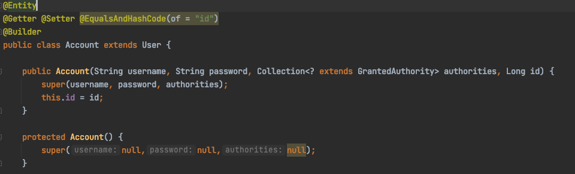
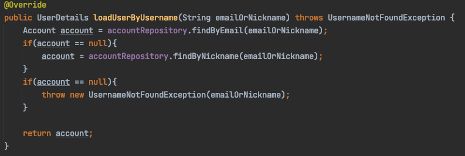

# @AuthenticationPrincipal
---
애플리케이션에서 로그인한 사용자와 관련된 특정한 정보들을 조회하는 건 모든 회원제 어플리케이션에서 빈번하게 일어나는 작업이다.  
하지만 이를 위해 매번 사용자가 서버에 요청을 보낼때마다 DB에 접근해서 데이터를 가져오는 것은 그 자체로 비효율적이다.

따라서 한번 인증된 사용자 정보를 세션에 담아놓고 세션이 유지되는 동안 유저객체를 DB접근 없이 가져다 쓰는 것을 생각 해볼 수있다.  
Spring Security에선 이 정보를 SecurityContextHolder내부의 SecurityContext에 Authentication 객체로 저장해두고 있으며, 이를 참조하는 방법은 크게 3가지가 있다.

>* 컨트롤러에서 Principal 객체를 주입받아 사용
* 컨트롤러에서 @AuthenticationPrincipal 선언하여 엔티티 객체 받아오기
* 컨트롤러에서 @AuthenticationPrincipal 선언하여 엔티티의 어댑터 객체 받아오기(가장 권장)

1. 컨트롤러에서 Principal 객체 주입받아 사용

가장 간단하게 사용할 수 있는 방법이지만, 이는 <strong>Spring Security가 제공하는 객체가 아닌</strong>, 자바에 정의되어있는 Principal 객체를 바인딩 해주는 것이라 사용할 수 있는 메소드가 getName()밖에 없다.

2. @AuthenticationPrincipal 선언해서 엔티티 객체 받아오기

엔티티객체

서비스클래스

